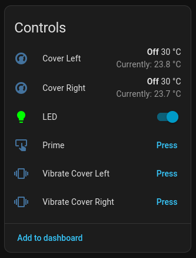
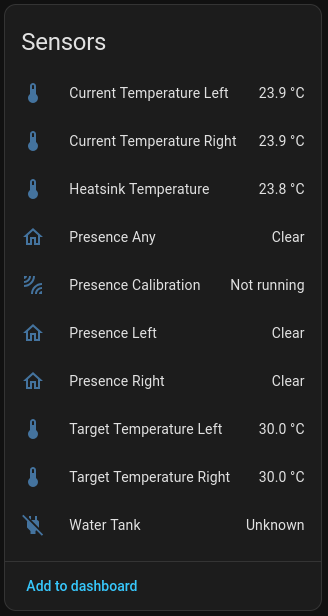
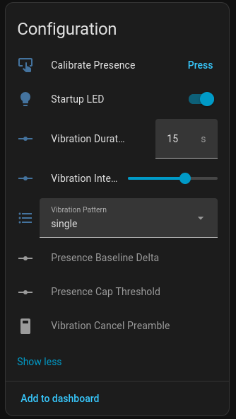
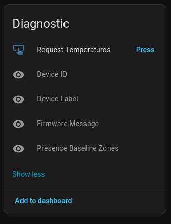

# 🌙 Lunaris
<a href="https://www.buymeacoffee.com/schluggi" target="_blank"></a>

This is a replacement firmware for Eight Sleep pods. It's local, cloud-less and communicates directly with the serial devices. 

Home Assistant first approach. It supports MQTT discovery so no need for manual configuration.

This is an AI-fork of [opensleep](https://github.com/LiamSnow/opensleep).

## ⚠️ Disclaimer
This project is for personal, educational, and research use. It is not affiliated with, endorsed by, or sponsored by Eight Sleep. “Eight Sleep” and related names are trademarks of Eight Sleep, Inc.

Using custom firmware or low-level hardware control may void warranties, break the vendor app, or in rare cases damage hardware. Use at your own risk!

## 🛏️ Supported Pods
- ❌ Pod 1
- ❌ Pod 2
- ⚠️ Pod 3 (should work, untested)
- ✅ Pod 4 
- ⚠️ Pod 5 (should work, untested)


## 🎉 Highlights
- ✅ Full Home Assistant integration
- ✅ Single all-in-one replacement
- ✅ Cover buttons
- ✅ Vibration
- ✅ Temperature control
- ✅ LED control
- ✅ Self update
- ✅ Presence detection
- ❌ Biometrics (work in progress)


## 🤔 Comparison

How Lunaris differs from other local-control projects ([free-sleep](https://github.com/throwaway31265/free-sleep), [opensleep](https://github.com/LiamSnow/opensleep), [ninesleep](https://github.com/bobobo1618/ninesleep)):

| Topic | Lunaris | [free-sleep](https://github.com/throwaway31265/free-sleep) | [opensleep](https://github.com/LiamSnow/opensleep) | [ninesleep](https://github.com/bobobo1618/ninesleep) |
|:---|:---|:---|:---|:---|
| Goal | MQTT + Home Assistant for Pod hardware over USART | Jailbreak Pod + LAN web app and REST API | Replace vendor SOM apps; full Rust firmware on Pod | Replace `dac` only; HTTP API to frankenfirmware |
| Stack | Rust | Node/Express + React (+ optional Python biometrics) | Rust | Rust |
| License | GPL-3.0 | MIT | GPL-3.0 | MIT |
| Automation / HA | Native MQTT discovery, no extra config | REST / custom integration | MQTT + RON config | REST / HTTP |
| Built-in web UI | No (HA is the UI) | Yes | No | No |
| Configuration | CLI flags (ports, broker, pod model) | App + JSON storage | `.ron` files | Driven by HTTP clients |
| Pod generations | Pod 4 focus; Pod 3/5 best-effort | Pod 3–5 documented | Pod 3 tested; Pod 4/5 untested | Pod 3 documented |


## 🏠 Entities

### Controls



| Name | Kind | Hidden by default | What it does |
|:---|:---|:---:|:---|
| Cover Left / Right | climate | No | Set how warm or cool each side of the bed should feel. |
| LED | light | No | Colour and brightness for the indicator LED on the bed. |
| Prime | button | No | Tell the pod to prepare / prime its water system before use. |
| Vibrate Cover Left / Right | button | No | Run a vibration on that side. |

### Sensors



| Name | Kind | Hidden by default | What it does |
|:---|:---|:---:|:---|
| Ambient Humidity | sensor | No | Relative ambien humidity send by the cover sensor. |
| Ambient Temperature | sensor | No | Ambient temperature send by the cover sensor. |
| Cover Button Left / Right | sensor | No | Tap count `1`-`5`, `0` when idle. |
| Current Cover Temperature Left / Right | sensor | No | How warm each side of the mattress is right now. |
| Heatsink Temperature | sensor | No | Temperature of the cooling hardware. |
| Presence Any | binary_sensor | No | Someone is detected on either side of the bed. |
| [Presence Calibration](#presence-calibration) | binary_sensor | No | On while lunaris is learning an “empty bed” baseline. |
| Presence Left / Right | binary_sensor | No | Someone is detected on that side of the mattress. |
| Target Temperature Left / Right | sensor | No | Same target you set on the climate control, shown as plain numbers for dashboards or cards. |
| [Water Tank](#water-tank) | binary_sensor | No | Shows whether the water tank is plugged in. |

### Configuration



| Name | Kind | Hidden by default | What it does |
|:---|:---|:---:|:---|
| Firmware | update | No | Updates Lunaris itself by pulling the latest version from GitHub releases. |
| Calibrate Presence | button | No | Start learning what an empty mattress looks like (keep the bed clear for ~10s afterwards). |
| [Presence Baseline Delta](#presence-calibration) | number | Yes | Fine-tune sensitivity after calibration. |
| [Presence Cap Threshold](#presence-calibration) | number | Yes | Fine-tune rough “capacitance” sensitivity before calibration. |
| LED Behavior | select | No | Chooses LED startup/runtime behavior:<br>- `Manual` (off at boot, only light entity controls it)<br>- `Status` (solid green while lunaris runs)<br>- `Startup` (green for 5s on boot, then off and manual control). |
| Vibration Cancel Preamble | switch | Yes | Tweaks vibration behaviour — leave as-is unless troubleshooting. |
| Vibration Duration | number | No | How long vibrations last when you press a vibrate button. |
| Vibration Intensity | number | No | How strong vibrations feel (percentage). |
| Vibration Pattern | select | No | Simple vs double vibration pattern. |

### Diagnostics



| Name | Kind | Hidden by default | What it does |
|:---|:---|:---:|:---|
| Device ID | sensor | Yes | Short internal id taken from pod files when available; mostly for support. |
| Device Label | sensor | Yes | Human-readable pod name from disk when available; mostly for support. |
| Frozen Message | sensor | Yes | Text, send by the Frozen MCU. |
| Sensor Message | sensor | Yes | Text, send by the Sensor MCU. |
| Presence Baseline Zones | sensor | Yes | Raw saved calibration snapshot for nerds/support; not usually needed daily. |
| System Uptime | sensor | No | Shows the local date/time since when the pod OS has been running (last reboot timestamp). |
| Frozen Link | binary_sensor | No | `ON` when valid Frozen MCU traffic was decoded. |
| Sensor Link | binary_sensor | No | `ON` when valid Sensor MCU traffic was decoded. |
| Internet Access | binary_sensor | No | `ON` when the configured URL (default: lunaris GitHub project page) is reachable (checked every 60s). Change the URL with `--internet-access-url`. |
| Reboot Pod | button | No | Restarts the pod. |
| Restart Lunaris | button | No | Restarts the lunaris process. |
| Shutdown Pod | button | No | Powers off the pod. |
| Request Temperatures | button | No | Ask the pod to refresh its temperature readings (troubleshooting / curiosity). |

## 📦 Installation

### 1. Get Root Access
There is an excellent guide from [free-sleep](https://github.com/throwaway31265/free-sleep/blob/main/INSTALLATION.md).
We only need steps 1-12.

### 2. Disable Cloud
Because free-sleep uses a different approach to communicate to the pod, we have to disable an additional service:

```bash
systemctl disable --now frank
systemctl mask frank
```

Also make sure you blocked the Eight Sleep servers in your `/etc/hosts`:
```
127.0.0.1 	raw-api-upload.8slp.net update-api.8slp.net device-api.8slp.net 8slp.net
```

### 3. Install lunaris
Connect to your pod and run these commands in a root shell:
```bash
# Download lunaris
wget https://github.com/Schluggi/lunaris/releases/latest/download/lunaris -O /usr/bin/lunaris

# Make the binary executable
chmod +x /usr/bin/lunaris

# Download unit file
wget https://github.com/Schluggi/lunaris/raw/refs/heads/main/systemd/lunaris.service -O /etc/systemd/system/lunaris.service

# Edit ExecStart — at minimum set broker + pod (see README [Quick start](#cli-quick-start), full tables [below](#cli-arguments))
vi /etc/systemd/system/lunaris.service

# Activate service
systemctl daemon-reload
systemctl enable --now lunaris
```
### 4. Configure Priming
There is no periodic priming built-in. You have to manage it yourself.

Lunaris [provides a blueprint](./blueprints/) for this.


<a id="cli-arguments"></a>

## ⚙️ Arguments

All settings are CLI-only (there is no config file or ENVs). `lunaris --help` lists the same flags.

<a id="cli-quick-start"></a>

### Quick start
```bash
lunaris \
  --mqtt-host 192.168.1.40 \
  --mqtt-username user123 \
  --mqtt-password password123 \
  --pod 4 # 3/4/5
```

 Option | Default | Required | Description |
|--------|---------|:--------:|-------------|
| `--pod` | — | Yes | Your Pod generation: 3, 4, or 5. Chooses sensible default serial speeds. |
| `--self-update-poll-secs` | `43200` | No | How often lunaris checks GitHub for a newer release (`12h` by default). Set to `0` to disable self-update polling and hide the Firmware update entity. |
| `--internet-access-url` | `https://github.com/Schluggi/lunaris` | No | URL the Internet Access sensor probes (every 60s). |

### MQTT
| Option | Default | Required | Description |
|--------|---------|:--------:|-------------|
| `--device-identifier` | `lunaris_pod` | No | Stable id so Home Assistant recognizes the same device across restarts. |
| `--device-name` | `Eight Sleep` | No | Name shown for the device in Home Assistant. |
| `--discovery-prefix` | `homeassistant` | No | Where Home Assistant expects [MQTT discovery](https://www.home-assistant.io/integrations/mqtt/#mqtt-discovery) messages (change only if your setup uses a different prefix). |
| `--mqtt-client-id` | `lunaris` | No | Name of this program on the MQTT broker. |
| `--mqtt-host` | — | Yes | Your MQTT broker (hostname or IP). |
| `--mqtt-password` | — | No | Broker password, if required. |
| `--mqtt-port` | `1883` | No | Broker port. |
| `--mqtt-username` | — | No | Broker username, if required. |
| `--payload-press` | `PRESS` | No | Text Home Assistant sends when you “press” an MQTT button; must match what discovery advertises. |
| `--topic-prefix` | `lunaris/pod4` | No | Leading part of all topics for this bed (availability, controls, sensors, etc.). |


### Climate
| Option | Default | Required | Description |
|--------|---------|:--------:|-------------|
| `--climate-max-temp` | `47` | No | Highest setpoint (°C) allowed in the climate controls. |
| `--climate-min-temp` | `13` | No | Lowest setpoint (°C) allowed. |
| `--climate-temp-step` | `0.5` | No | Step size (°C) for the temperature slider. |

### Debugging
| Option | Default | Required | Description |
|--------|---------|:--------:|-------------|
| `--i2c-device` | `/dev/i2c-1` | No | I²C bus used for the status LED. If it is missing, everything else still works except the light in Home Assistant. |
| `--log-level` | `info` | No | How chatty the logs are when `RUST_LOG` is not set. |
| `--sensor-baud` | (from `--pod`; Pod 4 / 5 → `921600`) | No | Speed for the sensor/vibration serial line; change if your hardware needs it. |
| `--sensor-device` | `/dev/ttyS2` | No | Serial port for vibration and presence. If it cannot be opened, heating and MQTT still work, but not vibration or presence. |
| `--sensor-vibrate-no-ack-wait` | (off) | No | Try this if vibration never starts but you suspect the sensor port does not report replies. |
| `--serial-baud` | (from `--pod`; Pod 4 / 5 → `38400`) | No | Speed for the main (temperature) serial line. |
| `--serial-device` | `/dev/ttyS1` | No | Serial port for temperature and related control. Required: the program exits if this port cannot be opened. |


## 🔨 How To Build
- Host: Ubuntu 24.04
- Rust: Same version as [rust-toolchain.toml](rust-toolchain.toml)

```bash
# Download & install zig (https://ziglang.org/download/)
wget https://ziglang.org/download/0.16.0/zig-x86_64-linux-0.16.0.tar.xz -O /opt/zig-x86_64-linux-0.16.0.tar.xz
cd /opt/
tar xfv zig-x86_64-linux-0.16.0.tar.xz
export PATH=${PATH}:/opt/zig-x86_64-linux-0.16.0/
cd -

# Setup Zigbuild
rustup target add aarch64-unknown-linux-musl
cargo install cargo-zigbuild

# Build
cargo zigbuild --release --target aarch64-unknown-linux-musl
```

Output: `./target/aarch64-unknown-linux-musl/release/lunaris`.


## ❓ FAQ

### Presence Calibration
When lunaris starts and the MQTT topic does not exist yet (this is normally the first start ever), it will automatically calibrate the presence sensors.
You can also calibrate manually via the `Calibrate Presence` button entity.
For fine-tuning, use `Presence Baseline Delta` and `Presence Cap Threshold` on the device.  
> Hint: Increase the `Presence Baseline Delta` by 150 after pressing `Calibrate Presence`. This fixes it for me.

### Water Tank
The Water Tank binary sensor often shows `unknown` briefly at startup until the bridge has parsed reservoir state. You can usually refresh it by pulling the tank out and plugging it back in.


## 🙏 Special Thanks
- [LiamSnow](https://github.com/LiamSnow/) for the great research and groundwork on the protocol ([opensleep](https://github.com/LiamSnow/opensleep)).
- [throwaway31265](https://github.com/throwaway31265) for [free-sleep](https://github.com/throwaway31265/free-sleep) and the instructions on how to root.
- [OsirisSpectrum](https://github.com/OsirisSpectrum) for the naming idea of this project.

## ⚖️ License
SPDX: GPL-3.0-only. See [LICENSE](LICENSE). CRC/framing for Frozen frames derives from [opensleep](https://github.com/LiamSnow/opensleep) (same license).
